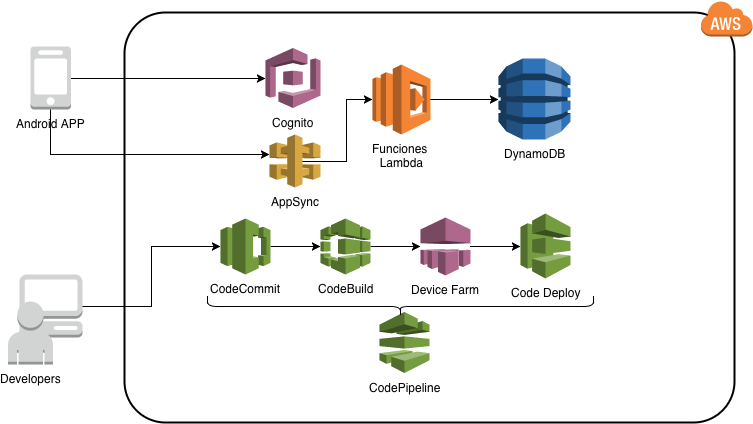

# AWS Mobile App workshop

This workshop has been develop to teach how AWS tools could be used to develop a Mobile APP using the followin AWS services:

* AWS Amplify Framework
* Amazon Cognito
* AWS Lambda
* AWS AppSync
* Amazon DynamoDB
* AWS CodePipeline
* AWS CodeDeploy
* AWS CodeBuild
* AWS Device Farm
* AWS Sumerian

**Tutorial Prereqs:**

* **An AWS Account and Administrator-level access to it**
* **Developer credentials**
* **Android Studio**
* **Basic Java language knowledge**

During the Workshop all code will be provided and almost all the commands will be executed using CLI. Is highly recommended to use an AWS Account for development and education, without access to production systems or data, to avoid security issues. You could have a new account with extra benefits in the first 12 months of the [AWS Free Tier](https://aws.amazon.com/free/) . After you complete the workshop, make sure you delete all AWS resources to avoid further costs.

## **Overview**

AWS provides all the services and features required for a developer to create high performance, resilient and scalable applications. During this workshop we will develope an Augmented Reality Application with restricted access using serverless backend and find bugs using automated tests.

As a developer you could beging with a small application and start growing it adding more capabilities on each iteration.

Lets start: [Add Login](./login.md) into your project.

## **AWS Developer Center**

For more details on tools and services for developers provided by AWS, please visit our [Developer Center](https://developer.aws).

For information on best practices for modern application development, please [visit here](https://aws.amazon.com/modern-apps/).
