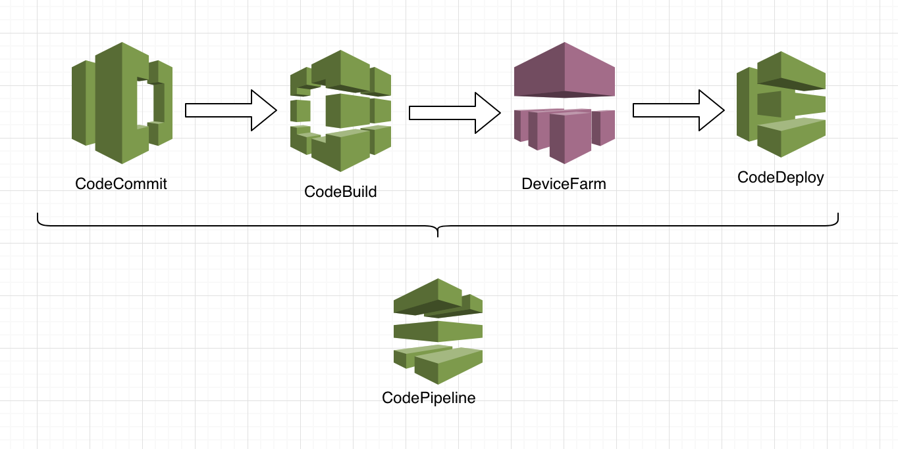

# Module CI/CD

## Create Deploymente Pipelines

In the following module we will use several tools to automate the code commit, the code build, testing our code and deployment using a fully managed CI/CD stack:



Download the following [ZIP](./ConfigFiles.zip)  file and create a new folder inside your Android App. Unzip all the files inside and access the folder with the Terminal.

As pre-step, we will run the following command to create roles using AWS CloudFormation. This is good way to create resources on AWS as code in future cases the whole pipeline could be created using this service but for teaching porpouse we will do step by step.
On the Android Studio Terminal section copy the following code

```bash

aws cloudformation create-stack --stack-name MyfirstMobileApp --capabilities CAPABILITY_NAMED_IAM --template-body file://CF-Roles.yaml

```

This should run fast but after a minute execute the next command to get the ARN created because we will need it for the next steps:

```bash
aws cloudformation describe-stacks --stack-name MyfirstMobileApp > 1_cloudformation-roles-output.json
```

The first step will be create a S3 bucket where we could deliver temporary artifacts that are created in the middle of our CI/CD pipeline executions. 
Using the Terminal window we will create the Bucket. The name should be unique with NO CAPITAL letters, use something like:

mobile-app-yourname

Be aware that the S3 bucket name should comply the following rules:

* The bucket name can be between 3 and 63 characters long, and can contain only lower-case characters, numbers, periods, and dashes.
* Each label in the bucket name must start with a lowercase letter or number.
* The bucket name cannot contain underscores, end with a dash, have consecutive periods, or use dashes adjacent to periods.
* The bucket name cannot be formatted as an IP address (198.51.100.24)


```bash
aws s3 mb s3://REPLACE_ME_CHOOSE_ARTIFACTS_BUCKET_NAME
```

Now we have to change the policy of the bucket to access only by our CI/CD pipeline, to do this here is the JSON file `/artifacts-bucket-policy.json` that will use, but need to modify the BUCKET NAME and the ARN ROLE that is saved on the file `1_cloudformation-roles-output.json`

Once you have change the file, saved it and execute the following command to grant access to this bucket:

```bash
aws s3api put-bucket-policy --bucket REPLACE_ME_ARTIFACTS_BUCKET_NAME --policy file://artifacts-bucket-policy.json
```

## Create a CodeCommit Repo

Now we could create a repository to manage and store all the code. Again we will use the Terminal Window on Android Studio to execute the following command:

```bash
aws codecommit create-repository --repository-name MyFirstMobileApp-Repo
```

## Create a CodeBuild Project

The next step is build our code. We have a bucket and repo to store our code, CodeBuild will be the CI/CD stack with a way for a service build to occur.  Any time a build execution is triggered, AWS CodeBuild will automatically provision a build server to our configuration and execute the steps required to build our code. The **buildspec.yml** file is what you create to instruct CodeBuild what steps are required for a build execution within a CodeBuild project.

To create the CodeBuild project, another CLI input file is required to be updated with parameters specific to your resources. It is located at /Builder-Mobapp.json . Similarly replace the values within this file as you have done before from the cloudformation-roles-output.json file. Once saved, execute the following with the CLI to create the project:

```bash
aws codebuild create-project --cli-input-json file://Builder-Mobapp.json
```

We will create another CodeBuild element to deliver the APK to the S3 Bucket after the test that will be run on AWS Device Farm.
The following file:
/Resources-AWS/Deliver-Mobapp.json

```bash
aws codebuild create-project --cli-input-json file://Deliver-Mobapp.json
```

## Create a CodePipeline Pipeline

Finally, we need a way to continuously integrate our CodeCommit repository with our CodeBuild project so that builds will automatically occur whenever a code change is pushed to the repository. Then, we need a way to continuously deliver those newly built artifacts to DEVICE FARM in order to test it.

Your pipeline in CodePipeline will do just what I described above. Anytime a code change is pushed into your CodeCommit repository, CodePipeline will deliver the latest code to your AWS CodeBuild project so that a build will occur. When successfully built by CodeBuild.

All of these steps are defined in a JSON file provided that you will use as the input into the AWS CLI to create the pipeline. This file is located at ***~/Resources-AWS/code-pipeline.json***, open it and replace the required attributes within, and save the file.

Once saved, create a pipeline in CodePipeline with the following command:

```bash
aws codepipeline create-pipeline --cli-input-json file://Pipeline-Mobapp.json
```

## Create an AWS Device Farm project

Now we will add AWS Device Farm as new stage for the Pipeline. This step will be done on AWS Console.

We will need to create a DeviceFarm Project first in order to select devices and get this information to the next steps.
On AWS Console, select ***Device Farm***
Click on **Create a new project**, and type a name.
At the right corner click on **Project settings**
Then select the tab **Device Pools** and then **Create a new Device Pool**.
In the next window, type a name and description.
Scroll down to **Select devices** section and select **Android** on Plataform, and **7** for OS Version. Then select 5 devices at the list.
Click on **Save device pool** and click on **Done** to close the window.

Next on Android Studio Terminal type the next code to get the project ARN

```bash
aws devicefarm list-projects
```
Then select and copy the project ARN, should be something like:

```json
"arn": "arn:aws:devicefarm:us-west-2:44XX4433XX:project:75aaa57-1a98-4aae-e401-fde91a8",
```

Then copy the next code again and replace the **< ARN >** with the project ARN

```bash
aws devicefarm list-device-pools --arn <ARN>
```

Copy the device pool ARN, the value is below the **name** into a notepad.

## Add AWS Device Farm to our AWS CodePipeline

On Services type ***pipe*** and select ***CodePipeline***

* Our Pipeline should be at the list, click on the name, and validate all data is correct.

To test out the new pipeline, we need to configure git within your Cloud9 IDE and integrate it with your CodeCommit repository.

AWS CodeCommit provides a credential helper for git that we will use to make integration easy.  Run the following commands in sequence on the **ROOT folder of your project** in the terminal to configure git to be used with AWS CodeCommit (neither will report any response if successful):

```bash
git config --global user.name "REPLACE_ME_WITH_YOUR_NAME"
```

```bash
git config --global user.email REPLACE_ME_WITH_YOUR_EMAIL@example.com
```

```bash
git config --global credential.helper '!aws codecommit credential-helper $@'
```

```bash
git config --global credential.UseHttpPath true
```

Now, we are ready to push our repository. First will list our repository, and then get the HTTP address 

```bash
aws codecommit list-repositories 
aws codecommit get-repository --repository-name  [NOMBRE_REPOSITORY]
git init
git add .
git commit -m "First commit"
git remote add origin  https://git-codecommit.[REPLACE GIT HTTPS URL]
git remote -v
git push -u origin master
```

After the change is pushed into the repository, you can open the CodePipeline service in the AWS Console to view your changes as they progress through the CI/CD pipeline. After committing your code change, it will take about 5 to 10 minutes for the changes to be deploy on Device Farm and run the tests.
