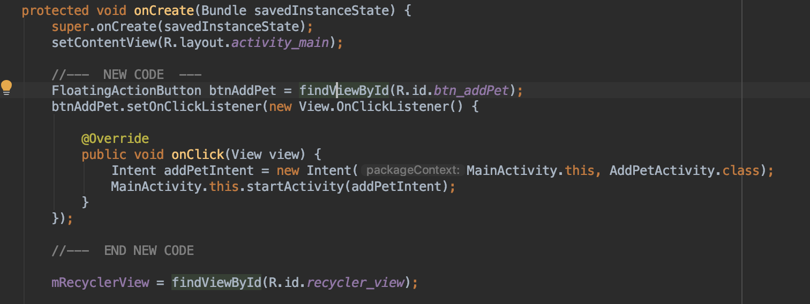

# Module Add Backend

In the previous module we add authentication to our application. Now we will add the Backend to save data using NO SQL database and will use GraphQL to get information. Also a Serverless functions (Lambdas) will be part of the backend.


## Add the AWS AppSync client

We need to add another dependency for the **recyclerview**  in the app‘s build.gradle*, add the following line, and click on **sync**

```bash
    implementation 'androidx.recyclerview:recyclerview:1.0.0'
```

We now need to create an AWSAppSyncClient to perform API calls. Add a new **ClientFactory.java** class in your package. This class should be part of the App:


```java
public class ClientFactory {
    private static volatile AWSAppSyncClient client;

    public static synchronized void init(final Context context) {
        if (client == null) {
            final AWSConfiguration awsConfiguration = new AWSConfiguration(context);
            client = AWSAppSyncClient.builder()
                     .context(context)
                     .awsConfiguration(awsConfiguration)
                     .cognitoUserPoolsAuthProvider(new CognitoUserPoolsAuthProvider() {
                        @Override
                        public String getLatestAuthToken() {
                            try {
                                return AWSMobileClient.getInstance().getTokens().getIdToken().getTokenString();
                            } catch (Exception e){
                                Log.e("APPSYNC_ERROR", e.getLocalizedMessage());
                                return e.getLocalizedMessage();
                            }
                         }
                     }).build();
         }
    }

    public static synchronized AWSAppSyncClient appSyncClient() {
        return client;
    }
}

```

This **ClientFactory** class supplies an AppSync client, which we can leverage to perform data access activities.


## Query for data

We don’t have any data in our list yet, but let’s build the capacity to display them when we do have data.

Add a RecyclerView to display a list of items
Now let’s start building our app to enable the display of items.

We’re using **RecyclerView** to display data. Open **src/res/layout/content_main.xml**, switch to Text view, and replace the **< TextView >** with the following:

```html
   <androidx.recyclerview.widget.RecyclerView
        android:id="@+id/recycler_view"
        android:layout_width="match_parent"
        android:layout_height="wrap_content"
        tools:ignore="MissingConstraints" />
```

Now let’s define what each item in our list looks like. Right-click your res/layout folder, add a new **Layout resource file**. Let’s call it **recyclerview_row.xml**. Change the Root element to **LinearLayout**, keep the rest as default, and choose OK.


Switch to the Text view of recyclerview_row.xml, and modify the layout as follows:

```xml
<?xml version="1.0" encoding="utf-8"?>
<LinearLayout
    xmlns:android="http://schemas.android.com/apk/res/android"
    android:layout_width="match_parent"
    android:layout_height="wrap_content"
    android:orientation="vertical"
    android:padding="10dp">

    <TextView
        android:layout_width="match_parent"
        android:layout_height="wrap_content"
        android:layout_marginTop="10dp"
        android:paddingLeft="10dp"
        android:textSize="15dp"
        android:id="@+id/txt_name"
        />
    <TextView
        android:layout_width="match_parent"
        android:layout_height="wrap_content"
        android:layout_marginTop="10dp"
        android:paddingLeft="10dp"
        android:textSize="15dp"
        android:id="@+id/txt_description"
        />

</LinearLayout>
```

Because we’re using a RecyclerView, we need to provide an adapter for it. Add a new Java class **MyAdapter.java**, which extends **RecyclerView.Adapter**:

```java
public class MyAdapter extends RecyclerView.Adapter<MyAdapter.ViewHolder> {

    private List<ListPetsQuery.Item> mData = new ArrayList<>();;
    private LayoutInflater mInflater;


    // data is passed into the constructor
    MyAdapter(Context context) {
        this.mInflater = LayoutInflater.from(context);
    }

    // inflates the row layout from xml when needed
    @Override
    public ViewHolder onCreateViewHolder(ViewGroup parent, int viewType) {
        View view = mInflater.inflate(R.layout.recyclerview_row, parent, false);
        return new ViewHolder(view);
    }

    // binds the data to the TextView in each row
    @Override
    public void onBindViewHolder(ViewHolder holder, int position) {
        holder.bindData(mData.get(position));
    }

    // total number of rows
    @Override
    public int getItemCount() {
        return mData.size();
    }

    // resets the list with a new set of data
    public void setItems(List<ListPetsQuery.Item> items) {
        mData = items;
    }

    // stores and recycles views as they are scrolled off screen
    class ViewHolder extends RecyclerView.ViewHolder {
        TextView txt_name;
        TextView txt_description;

        ViewHolder(View itemView) {
            super(itemView);
            txt_name = itemView.findViewById(R.id.txt_name);
            txt_description = itemView.findViewById(R.id.txt_description);
        }

        void bindData(ListPetsQuery.Item item) {
            txt_name.setText(item.name());
            txt_description.setText(item.description());
        }
    }
}

```

Note the class-level variable mData. It’s a list of type ListPetsQuery.Item, which is a generated GraphQL type that’s based on our schema.

We have also exposed a setItems method, to allow outside resetting of our dataset.

Build the screen to populate the RecyclerView
Open MainActivity.java, modify the class to implement a query method, and populate the RecyclerView:

```java
public class MainActivity extends AppCompatActivity {

    RecyclerView mRecyclerView;
    MyAdapter mAdapter;

    private ArrayList<ListPetsQuery.Item> mPets;
    private final String TAG = MainActivity.class.getSimpleName();

    protected void onCreate(Bundle savedInstanceState) {
        super.onCreate(savedInstanceState);
        setContentView(R.layout.activity_main);

        mRecyclerView = findViewById(R.id.recycler_view);

        // use a linear layout manager
        mRecyclerView.setLayoutManager(new LinearLayoutManager(this));

        // specify an adapter (see also next example)
        mAdapter = new MyAdapter(this);
        mRecyclerView.setAdapter(mAdapter);

        ClientFactory.init(this);
    }

    @Override
    public void onResume() {
        super.onResume();

        // Query list data when we return to the screen
        query();
    }

    public void query(){
        ClientFactory.appSyncClient().query(ListPetsQuery.builder().build())
                .responseFetcher(AppSyncResponseFetchers.CACHE_AND_NETWORK)
                .enqueue(queryCallback);
    }

    private GraphQLCall.Callback<ListPetsQuery.Data> queryCallback = new GraphQLCall.Callback<ListPetsQuery.Data>() {
        @Override
        public void onResponse(@Nonnull Response<ListPetsQuery.Data> response) {

            mPets = new ArrayList<>(response.data().listPets().items());

            Log.i(TAG, "Retrieved list items: " + mPets.toString());

            runOnUiThread(new Runnable() {
                @Override
                public void run() {
                    mAdapter.setItems(mPets);
                    mAdapter.notifyDataSetChanged();
                }
            });
        }

        @Override
        public void onFailure(@Nonnull ApolloException e) {
            Log.e(TAG, e.toString());
        }
    };
}
```

The **appSyncClient** is responsible for querying the AWS AppSync GraphQL endpoint. We chose to use the CACHE_AND_NETWORK mode because it retrieves the data in the local cache first, while reaching out to the network for latest data. After the fetch is complete, queryCallback is invoked again, and our dataset is updated with the latest data. There are other cache or network-only/first modes that you can use, depending on your app data fetching needs.

Build your app again to ensure that there are no errors. A blank screen still displays, but you should be able to see the log in the Logcat window. This indicates that a query has finished successfully, similar to the following:

## Add a pet

Now let’s add the ability to add a pet.

Add a new Empty Activity by choosing New -> Activity -> Empty Activity. Name the activity **AddPetActivity**, and choose Finish.

Open the layout file activity_add_pet.xml, and add the following layout inside of your existing **<android.support.constraint.ConstraintLayout>**:

```xml
<LinearLayout xmlns:android="http://schemas.android.com/apk/res/android"
        android:layout_width="match_parent"
        android:layout_height="match_parent"
        android:orientation="vertical"
        android:layout_margin="15dp">

    <TextView
        android:layout_width="wrap_content"
        android:layout_height="wrap_content"
        android:text="Name"
        android:textSize="15sp"
        />
    <EditText
        android:id="@+id/editTxt_name"
        android:layout_width="match_parent"
        android:layout_height="wrap_content" />
    <TextView
        android:layout_width="wrap_content"
        android:layout_height="wrap_content"
        android:text="Description"
        android:textSize="15sp" />
    <EditText
        android:id="@+id/editText_description"
        android:layout_width="match_parent"
        android:layout_height="wrap_content" />
    <Button
        android:layout_width="wrap_content"
        android:layout_height="wrap_content"
        android:id="@+id/btn_save"
        android:layout_marginTop="15dp"
        android:text="Save"/>
</LinearLayout>
```

This gives us basic input fields for the names and descriptions of our pets.

Open **AddPetActivity.java**, and add the following code to read the text inputs. Create a new mutation, which adds a new pet.

```java
public class AddPetActivity extends AppCompatActivity {
    private static final String TAG = AddPetActivity.class.getSimpleName();

    @Override
    protected void onCreate(Bundle savedInstanceState) {
        super.onCreate(savedInstanceState);
        setContentView(R.layout.activity_add_pet);

        Button btnAddItem = findViewById(R.id.btn_save);
        btnAddItem.setOnClickListener(new View.OnClickListener() {

            @Override
            public void onClick(View view) {
                save();
            }
        });
    }

    private void save() {
        final String name = ((EditText) findViewById(R.id.editTxt_name)).getText().toString();
        final String description = ((EditText) findViewById(R.id.editText_description)).getText().toString();

        CreatePetInput input = CreatePetInput.builder()
                .name(name)
                .description(description)
                .build();

        CreatePetMutation addPetMutation = CreatePetMutation.builder()
                .input(input)
                .build();
        ClientFactory.appSyncClient().mutate(addPetMutation).enqueue(mutateCallback);
    }

    // Mutation callback code
    private GraphQLCall.Callback<CreatePetMutation.Data> mutateCallback = new GraphQLCall.Callback<CreatePetMutation.Data>() {
        @Override
        public void onResponse(@Nonnull final Response<CreatePetMutation.Data> response) {
            runOnUiThread(new Runnable() {
                @Override
                public void run() {
                    Toast.makeText(AddPetActivity.this, "Added pet", Toast.LENGTH_SHORT).show();
                    AddPetActivity.this.finish();
                }
            });
        }

        @Override
        public void onFailure(@Nonnull final ApolloException e) {
            runOnUiThread(new Runnable() {
                @Override
                public void run() {
                    Log.e("", "Failed to perform AddPetMutation", e);
                    Toast.makeText(AddPetActivity.this, "Failed to add pet", Toast.LENGTH_SHORT).show();
                    AddPetActivity.this.finish();
                }
            });
        }
    };
}
```

Now let’s connect the AddPetActivity to our MainActivity.

Open the layout file activity_main.xml, and replace the floating button after the RecyclerView with the following:

```java
 <com.google.android.material.floatingactionbutton.FloatingActionButton
        android:id="@+id/btn_addPet"
        android:layout_width="wrap_content"
        android:layout_height="wrap_content"
        android:layout_gravity="bottom"
        android:layout_margin="16dp"
        android:tint="@android:color/white"
        app:srcCompat="@android:drawable/ic_input_add"/>
```

Open **MainActivity.java** again, and modify the existing code in onCreate to start the AddPetActivity when the **addPetbutton** is pressed:

```java
protected void onCreate(Bundle savedInstanceState) {
    //... Other code....

    FloatingActionButton btnAddPet = findViewById(R.id.btn_addPet);
      btnAddPet.setOnClickListener(new View.OnClickListener() {

          @Override
          public void onClick(View view) {
              Intent addPetIntent = new Intent(MainActivity.this, AddPetActivity.class);
              MainActivity.this.startActivity(addPetIntent);
          }
    });
}
```

The code should be like this:



Now let’s build and start the project, and then test out the adding functionality.

Sign in with your previously created user name and password if you’re prompted again. Then, in the empty screen, choose the “+” button:


You should then see the screen that prompts you to enter a name and a description. Enter some test values as below to add our first pet.


Choose Save to send the mutation along to create a pet. The creation should be successful, and you should see our first created item displayed in the list. This is because we previously specified in onResume() that we do a “re-fetch”, so that we have the most up-to-date data.

Next, [Add more Complex data](./data2.md) into your project.
