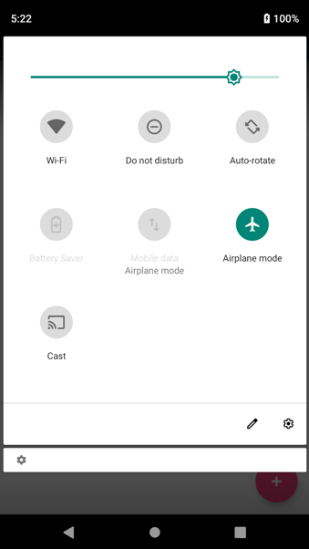
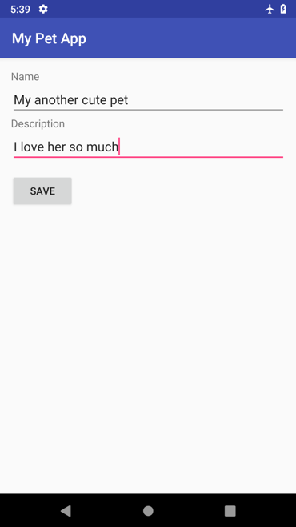
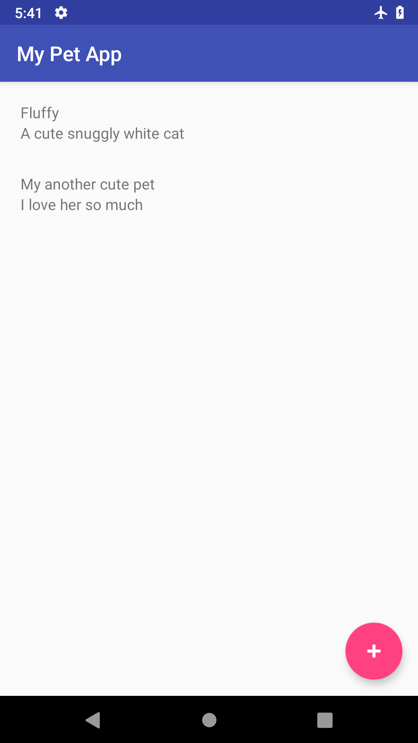
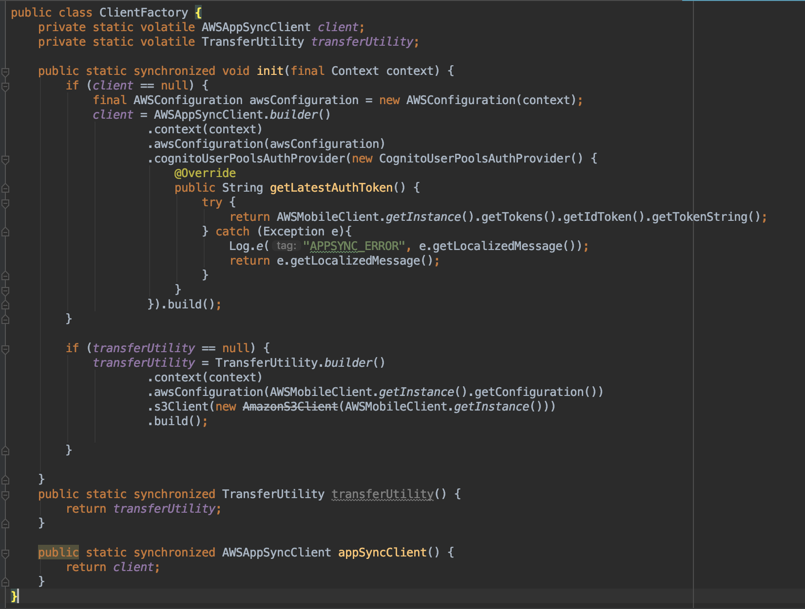
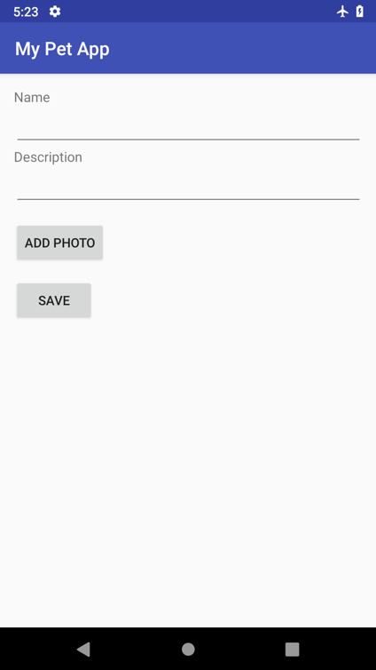
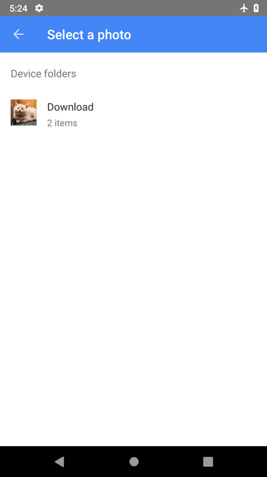
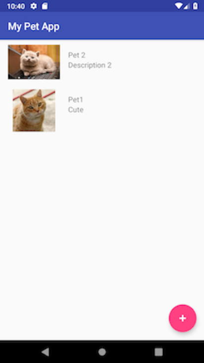

# Module Add more functions

At the end of the last module, we had created an Android app that displays a list of pets, and lets you add new pets. 
On this module we will add more addvanced features to our Android App:

* Using optimistic updates: AWS AppSync API offline support
* Using subscriptions on data changes (mutations)
* Enabling object storage through Amazon S3

## Optimistic updates and offline support

With the optimistic update functionality, you can provide a more responsive end user experience. You configure the UI so that it behaves as if the server will eventually return the data we expect. It’s being optimistic that the update is successful.

In this section, we create the data that we expect to be returned in memory after the mutation, and write it to the persistent SQL store that the Android device manages. Then when the server update returns, the SDK consolidates the data for you.

This approach works well with the scenario where internet connectivity is cut off while you’re trying to modify data. The AWS AppSync SDK automatically reconnects and sends the mutation when the app goes online.

Now let’s try it out. Open AddPetActivity.java, and add the offline support at the end of save():

```java
private void save() {
      // ... Other code ...

      ClientFactory.appSyncClient().mutate(addPetMutation).
              refetchQueries(ListPetsQuery.builder().build()).
              enqueue(mutateCallback);

      // Enables offline support via an optimistic update
      // Add to event list while offline or before request returns
      addPetOffline(input);
}
```

Now let’s add the ##addPetOffline## method. We check for connectivity after writing to the local cache, and close the activity as if the addition was successful.

```java
private void addPetOffline(CreatePetInput input) {

  final CreatePetMutation.CreatePet expected =
          new CreatePetMutation.CreatePet(
                  "Pet",
                  UUID.randomUUID().toString(),
                  input.name(),
                  input.description());

  final AWSAppSyncClient awsAppSyncClient = ClientFactory.appSyncClient();
  final ListPetsQuery listEventsQuery = ListPetsQuery.builder().build();
  

  awsAppSyncClient.query(listEventsQuery)
          .responseFetcher(AppSyncResponseFetchers.CACHE_ONLY)
          .enqueue(new GraphQLCall.Callback<ListPetsQuery.Data>() {
              @Override
              public void onResponse(@Nonnull Response<ListPetsQuery.Data> response) {
                  List<ListPetsQuery.Item> items = new ArrayList<>();
                  if (response.data() != null) {
                      items.addAll(response.data().listPets().items());
                  }

                  items.add(new ListPetsQuery.Item(expected.__typename(),
                          expected.id(),
                          expected.name(),
                          expected.description()));
                  ListPetsQuery.Data data = new ListPetsQuery.Data(new ListPetsQuery.ListPets("ModelPetConnection", items, null));
                  awsAppSyncClient.getStore().write(listEventsQuery, data).enqueue(null);
                  Log.d(TAG, "Successfully wrote item to local store while being offline.");

                  finishIfOffline();
              }

              @Override
              public void onFailure(@Nonnull ApolloException e) {
                  Log.e(TAG, "Failed to update event query list.", e);
              }
          });
    }

    private void finishIfOffline(){
        // Close the add activity when offline otherwise allow callback to close
        ConnectivityManager cm =
                (ConnectivityManager) getApplicationContext().getSystemService(Context.CONNECTIVITY_SERVICE);

        NetworkInfo activeNetwork = cm.getActiveNetworkInfo();
        boolean isConnected = activeNetwork != null &&
                activeNetwork.isConnectedOrConnecting();

        if (!isConnected) {
            Log.d(TAG, "App is offline. Returning to MainActivity .");
            finish();
        }
    }
```

We don’t need to change MainActivity because its query() method uses the CACHE_AND_NETWORK approach. It reads from the local cache first while making a network call. Our previously added pet already exists in the local cache because of optimistic update.

Build and run the app. After you sign in, turn on Airplane mode:



Go back to the app and try adding a new item. The UI experience should be the same as when you were online before. Enter a name and description:



Choose SAVE. The app should display the second item in the list.




Now turn Airplane mode off. The items should be automatically saved. You can verify that the save is successful by closing and reopening the app, and then confirming that you still see the same two items being displayed.

### Subscriptions

With AWS AppSync, you can use subscriptions for real-time notifications.

In this section, we use a subscription to let us know right away when someone else adds a new pet. To do this, let’s add the following block at the end of the MainActivity.java class:

```java
private AppSyncSubscriptionCall subscriptionWatcher;

    private void subscribe(){
        OnCreatePetSubscription subscription = OnCreatePetSubscription.builder().build();
        subscriptionWatcher = ClientFactory.appSyncClient().subscribe(subscription);
        subscriptionWatcher.execute(subCallback);
    }

    private AppSyncSubscriptionCall.Callback subCallback = new AppSyncSubscriptionCall.Callback() {
        @Override
        public void onResponse(@Nonnull Response response) {
            Log.i("Response", "Received subscription notification: " + response.data().toString());

            // Update UI with the newly added item
            OnCreatePetSubscription.OnCreatePet data = ((OnCreatePetSubscription.Data)response.data()).onCreatePet();
            final ListPetsQuery.Item addedItem = new ListPetsQuery.Item(data.__typename(), data.id(), data.name(), data.description());

            runOnUiThread(new Runnable() {
                @Override
                public void run() {
                    mPets.add(addedItem);
                    mAdapter.notifyItemInserted(mPets.size() - 1);
                }
            });
        }

        @Override
        public void onFailure(@Nonnull ApolloException e) {
            Log.e("Error", e.toString());
        }

        @Override
        public void onCompleted() {
            Log.i("Completed", "Subscription completed");
        }
    };
```

Then let’s modify the onResume method to call subscribe at the end, to subscribe to new pet creations. We also need to make sure that we unsubscribe when we’re done with the activity.

```java
@Override
public void onResume() {
      super.onResume();

      query();
      subscribe();
}

@Override
protected void onStop() {
    super.onStop();
    subscriptionWatcher.cancel();
}
```

Now let’s test it out. Build and run our app on your emulator.

Let’s then start up a second emulator. To start a second emulator, make sure that you have the default unselected. (Choose Run, choose Edit configurations. Under Android App, choose app, and clear the Use same device for future launches check box).

Also make sure that you have a different emulator device type in the AVD Manager. Run the app, choose your second emulator device, and have the app running side by side in these two emulators. Make sure that you sign into both so that you’re looking at the list of pets on both devices.

Add another pet in one of the apps, and watch it appear in the other app. Viola!

## Working with storage

With AWS Amplify, you can easily add object storage support by using Amazon S3. AWS Amplify manages the bucket provision and permission configuration for you automatically.

### Update AWS Amplify

To get started, let’s modify the local schema in **./amplify/backend/api/< PROJECTNAME >/schema.graphql** to add a photo string property:

```json
type Pet @model {
  id: ID!
  name: String!
  description: String
  photo: String
}
```

Next, go to our root directory, and run the following at the command line:

```bash
amplify add storage
```

Answer the following questions:

* Please select from one of the below mentioned services: **Content (Images, audio, video, etc.)**
* Please provide a friendly name for your resource that will be used to label this category in the project: **MyPetAppResources**
* Please provide bucket name: **mypetapp1246e0cde8074f78b94363dbe73f8adfdsfds** (or something unique)
* Who should have access: **Auth users only**
* What kind of access do you want for Authenticated users: **Update/Create, read, delete**
Then run:
* Do you want to add a Lambda Trigger for your S3 Bucket? **No**

```bash
amplify push
```

Choose Y when you’re asked whether you want to update code and regenerate GraphQL statements. Choose Enter, and wait for AWS CloudFormation updates to finish. This takes a couple of minutes.

### Add storage dependencies

Meanwhile, let’s update our front-end client code.

Open your app’s build.gradle, and add the dependency for Amazon S3, and click on **sync now**:

```bash
implementation 'com.amazonaws:aws-android-sdk-s3:2.15.+'
```


Open **AndroidManifest.xml**, and add the TransferService in our < application >:


```xml
<application>
    <!-- ...other code... -->
    <service android:name="com.amazonaws.mobileconnectors.s3.transferutility.TransferService" android:enabled="true" /> />
</application>
```

### Add photo selection code

Next, open AddPetActivity.java, and add the photo selection code:

```java
 // Photo selector application code.
  private static int RESULT_LOAD_IMAGE = 1;
  private String photoPath;

  public void choosePhoto() {
      Intent i = new Intent(Intent.ACTION_PICK, android.provider.MediaStore.Images.Media.EXTERNAL_CONTENT_URI);
      startActivityForResult(i, RESULT_LOAD_IMAGE);
  }

  @Override
  protected void onActivityResult(int requestCode, int resultCode, Intent data) {
      super.onActivityResult(requestCode, resultCode, data);
      if (requestCode == RESULT_LOAD_IMAGE && resultCode == RESULT_OK && null != data) {
          Uri selectedImage = data.getData();
          String[] filePathColumn = {MediaStore.Images.Media.DATA};
          Cursor cursor = getContentResolver().query(selectedImage,
                  filePathColumn, null, null, null);
          cursor.moveToFirst();
          int columnIndex = cursor.getColumnIndex(filePathColumn[0]);
          String picturePath = cursor.getString(columnIndex);
          cursor.close();
          // String picturePath contains the path of selected Image
          photoPath = picturePath;
      }
  }
```

We need to call the upload photo from the UI. Open activity_add_pet.xml, and add a button before the Save button:

```xml
<LinearLayout>
 <!-- ... other code... -->
  <Button
      android:layout_width="wrap_content"
      android:layout_height="wrap_content"
      android:id="@+id/btn_add_photo"
      android:layout_marginTop="15dp"
      android:text="Add Photo"/>

  <Button
      android:layout_width="wrap_content"
      android:layout_height="wrap_content"
      android:id="@+id/btn_save"
      android:layout_marginTop="15dp"
      android:text="Save"/>
</LinearLayout>
```

Now let’s connect this button to our **choosePhoto()** method. Go back to AddPetActivity.java, and modify onCreate to attach a click listener to the Save button:

```java
@Override
    protected void onCreate(Bundle savedInstanceState) {
        super.onCreate(savedInstanceState);
        setContentView(R.layout.activity_add_pet);

        Button btnAddItem = findViewById(R.id.btn_save);
        btnAddItem.setOnClickListener(new View.OnClickListener() {

            @Override
            public void onClick(View view) {
                    save();
            }
        });

        Button btnAddPhoto = findViewById(R.id.btn_add_photo);
        btnAddPhoto.setOnClickListener(new View.OnClickListener() {

            @Override
            public void onClick(View view) {
                choosePhoto();
            }
        });
    }
```

## Add Amazon S3 photo uploading code

Now that the photo can be selected, we need to make sure that the photo gets uploaded and stored in the backend. We’ll use TransferUtility to handle the Amazon S3 file upload and download. Let’s add its initialization code to our ClientFactory.java class.

```java
private static volatile TransferUtility transferUtility;

public static synchronized void init(final Context context) {
    // ... appsyncClient initialization code ...

    if (transferUtility == null) {
        transferUtility = TransferUtility.builder()
                .context(context)
                .awsConfiguration(AWSMobileClient.getInstance().getConfiguration())
                .s3Client(new AmazonS3Client(AWSMobileClient.getInstance()))
                .build();
    }
}
public static synchronized TransferUtility transferUtility() {
        return transferUtility;
}
```

The code should be like this:



Next, let’s add code to upload the photo by using the 
**TransferUtility** in our **AddPetActivity.java**:

```java
private String getS3Key(String localPath) {
    //We have read and write ability under the public folder
    return "public/" + new File(localPath).getName();
}

public void uploadWithTransferUtility(String localPath) {
    String key = getS3Key(localPath);

    Log.d(TAG, "Uploading file from " + localPath + " to " + key);

    TransferObserver uploadObserver =
            ClientFactory.transferUtility().upload(
                    key,
                    new File(localPath));

    // Attach a listener to the observer to get state update and progress notifications
    uploadObserver.setTransferListener(new TransferListener() {

        @Override
        public void onStateChanged(int id, TransferState state) {
            if (TransferState.COMPLETED == state) {
                // Handle a completed upload.
                Log.d(TAG, "Upload is completed. ");

                // Upload is successful. Save the rest and send the mutation to server.
                save();
            }
        }

        @Override
        public void onProgressChanged(int id, long bytesCurrent, long bytesTotal) {
            float percentDonef = ((float) bytesCurrent / (float) bytesTotal) * 100;
            int percentDone = (int)percentDonef;

            Log.d(TAG, "ID:" + id + " bytesCurrent: " + bytesCurrent
                    + " bytesTotal: " + bytesTotal + " " + percentDone + "%");
        }

        @Override
        public void onError(int id, Exception ex) {
            // Handle errors
            Log.e(TAG, "Failed to upload photo. ", ex);

            runOnUiThread(new Runnable() {
                @Override
                public void run() {
                    Toast.makeText(AddPetActivity.this, "Failed to upload photo", Toast.LENGTH_LONG).show();
                }
            });
        }

    });
}
```

## Save photo in mutation
Because we’ve added a new property to the Pet object, we need to modify our code to accommodate it. In AddPetActivity.java, extract the following method to produce different types of CreatePetInputs, depending on whether a photo has been selected:

```java
private CreatePetInput getCreatePetInput() {
    final String name = ((EditText) findViewById(R.id.editTxt_name)).getText().toString();
    final String description = ((EditText) findViewById(R.id.editText_description)).getText().toString();

    if (photoPath != null && !photoPath.isEmpty()){
        return CreatePetInput.builder()
                .name(name)
                .description(description)
                .photo(getS3Key(photoPath)).build();
    } else {
        return CreatePetInput.builder()
                .name(name)
                .description(description)
                .build();
    }
}
```

Next, we modify our save() to call the extracted method:

```java
private void save() {
    CreatePetInput input = getCreatePetInput();

    CreatePetMutation addPetMutation = CreatePetMutation.builder()
            .input(input)
            .build();

    ClientFactory.appSyncClient().mutate(addPetMutation).
            refetchQueries(ListPetsQuery.builder().build()).
            enqueue(mutateCallback);

    // Enables offline support via an optimistic update
    // Add to event list while offline or before request returns
    addPetOffline(input);
}
```

Because we changed the CreatePet mutation, we need to modify the addPetOffline code as well:

```java
private void addPetOffline(final CreatePetInput input) {

    final CreatePetMutation.CreatePet expected =
            new CreatePetMutation.CreatePet(
                    "Pet",
                    UUID.randomUUID().toString(),
                    input.name(),
                    input.description(),
                    input.photo());

    final AWSAppSyncClient awsAppSyncClient = ClientFactory.appSyncClient();
    final ListPetsQuery listPetsQuery = ListPetsQuery.builder().build();

    awsAppSyncClient.query(listPetsQuery)
            .responseFetcher(AppSyncResponseFetchers.CACHE_ONLY)
            .enqueue(new GraphQLCall.Callback<ListPetsQuery.Data>() {
                @Override
                public void onResponse(@Nonnull Response<ListPetsQuery.Data> response) {
                    List<ListPetsQuery.Item> items = new ArrayList<>();
                    if (response.data() != null) {
                        items.addAll(response.data().listPets().items());
                    }

                    items.add(new ListPetsQuery.Item(expected.__typename(),
                            expected.id(),
                            expected.name(),
                            expected.description(),
                            expected.photo()));
                    ListPetsQuery.Data data = new ListPetsQuery.Data(
                            new ListPetsQuery.ListPets("ModelPetConnection", items, null));
                    awsAppSyncClient.getStore().write(listPetsQuery, data).enqueue(null);
                    Log.d(TAG, "Successfully wrote item to local store while being offline.");

                    finishIfOffline();
                }

                @Override
                public void onFailure(@Nonnull ApolloException e) {
                    Log.e(TAG, "Failed to update event query list.", e);
                }
            });
    }
```

Then we can create a new method, uploadAndSave(), to handle both the photo and no-photo saves:

```java
private void uploadAndSave(){

    if (photoPath != null) {
      // For higher Android levels, we need to check permission at runtime
      if (ContextCompat.checkSelfPermission(this, Manifest.permission.READ_EXTERNAL_STORAGE)
              != PackageManager.PERMISSION_GRANTED) {
          // Permission is not granted
          Log.d(TAG, "READ_EXTERNAL_STORAGE permission not granted! Requesting...");
          ActivityCompat.requestPermissions(this,
                  new String[]{Manifest.permission.READ_EXTERNAL_STORAGE},
                  1);
      }

      // Upload a photo first. We will only call save on its successful callback.
      uploadWithTransferUtility(photoPath);
    } else {
        save();
    }
}
```

Now we can call our uploadAndSave() functions when the Save button is chosen:

```java
protected void onCreate(Bundle savedInstanceState) {
    // ... other code ...
    btnAddItem.setOnClickListener(new View.OnClickListener() {

        @Override
        public void onClick(View view) {
            uploadAndSave();
        }
    });
```

We also have to update the subscription callback in MainActivity.java because of the newly added photo property:

```java
private AppSyncSubscriptionCall.Callback subCallback = new AppSyncSubscriptionCall.Callback() {
        @Override
        public void onResponse(@Nonnull Response response) {
            Log.i("Response", "Received subscription notification: " + response.data().toString());

            // Update UI with the newly added item
            OnCreatePetSubscription.OnCreatePet data = ((OnCreatePetSubscription.Data)response.data()).onCreatePet();

            final ListPetsQuery.Item addedItem =
                    new ListPetsQuery.Item(data.__typename(), data.id(), data.name(), data.description(), data.photo());

            runOnUiThread(new Runnable() {
                @Override
                public void run() {
                    mPets.add(addedItem);
                    mAdapter.notifyItemInserted(mPets.size() - 1);
                }
            });
        }
        //...other event handlers ...
    };
```




Choose ADD PHOTO. You should be able to select a photo from your gallery. (If there’s no photo in the emulator, open the browser and download some photos from the internet.)



After you select a photo, you should be redirected back to the ADD screen.

## Download and display photos

Now that we’ve implemented the ability to save photos, let’s make sure that they get downloaded and displayed.

Open recyclerview_row.xml, add an **< ImageView >**, and modify the layout as follows:

```xml
<?xml version="1.0" encoding="utf-8"?>
<LinearLayout
    xmlns:android="http://schemas.android.com/apk/res/android"
    android:layout_width="match_parent"
    android:layout_height="wrap_content"
    android:orientation="horizontal"
    android:padding="10dp"
    android:weightSum="100">

    <ImageView
        android:id="@+id/image_view"
        android:layout_width="0dp"
        android:layout_height="match_parent"
        android:maxHeight="200dp"
        android:layout_weight="30"
        />

    <LinearLayout
        android:layout_width="0dp"
        android:layout_height="match_parent"
        android:orientation="vertical"
        android:layout_weight="70"
        android:layout_marginTop="10dp">

        <TextView
            android:id="@+id/txt_name"
            android:layout_width="match_parent"
            android:layout_height="wrap_content"
            android:textSize="15dp"
            android:paddingLeft="10dp" />

        <TextView
            android:id="@+id/txt_description"
            android:layout_width="match_parent"
            android:layout_height="wrap_content"
            android:textSize="15dp"
            android:paddingLeft="10dp" />
    </LinearLayout>

</LinearLayout>
```

Open MyAdapter.java. Add code to correspond to the photo property, and to download the photo if one exists.

```java
public class MyAdapter extends RecyclerView.Adapter<MyAdapter.ViewHolder> {
    // ... other code ...

    // stores and recycles views as they are scrolled off screen
    class ViewHolder extends RecyclerView.ViewHolder {
        TextView txt_name;
        TextView txt_description;
        ImageView image_view;
        String localUrl;

        ViewHolder(View itemView) {
            super(itemView);
            txt_name = itemView.findViewById(R.id.txt_name);
            txt_description = itemView.findViewById(R.id.txt_description);
            image_view = itemView.findViewById(R.id.image_view);
        }

        void bindData(ListPetsQuery.Item item) {
            txt_name.setText(item.name());
            txt_description.setText(item.description());

            if (item.photo() != null) {
                if (localUrl == null) {
                    downloadWithTransferUtility(item.photo());
                } else {
                    image_view.setImageBitmap(BitmapFactory.decodeFile(localUrl));
                }
            }
            else
                image_view.setImageBitmap(null);
        }

        private void downloadWithTransferUtility(final String photo) {
            final String localPath = Environment.getExternalStoragePublicDirectory(
                    Environment.DIRECTORY_DOWNLOADS).getAbsolutePath() + "/" + photo;

            TransferObserver downloadObserver =
                    ClientFactory.transferUtility().download(
                            photo,
                            new File(localPath));

            // Attach a listener to the observer to get state update and progress notifications
            downloadObserver.setTransferListener(new TransferListener() {

                @Override
                public void onStateChanged(int id, TransferState state) {
                    if (TransferState.COMPLETED == state) {
                        // Handle a completed upload.
                        localUrl = localPath;
                        image_view.setImageBitmap(BitmapFactory.decodeFile(localPath));
                    }
                }

                @Override
                public void onProgressChanged(int id, long bytesCurrent, long bytesTotal) {
                    float percentDonef = ((float) bytesCurrent / (float) bytesTotal) * 100;
                    int percentDone = (int) percentDonef;

                    Log.d(TAG, "   ID:" + id + "   bytesCurrent: " + bytesCurrent + "   bytesTotal: " + bytesTotal + " " + percentDone + "%");
                }

                @Override
                public void onError(int id, Exception ex) {
                    // Handle errors
                    Log.e(TAG, "Unable to download the file.", ex);
                }
            });
        }
    }
}
```

Because we’re downloading photos, we need to make sure that permissions can be granted. Go to MainActivity.java, and add the permission-seeking block in query():

```java
public void query(){
    if (ContextCompat.checkSelfPermission(this, Manifest.permission.WRITE_EXTERNAL_STORAGE)
            != PackageManager.PERMISSION_GRANTED) {
        // Permission is not granted
        Log.d(TAG, "WRITE_EXTERNAL_STORAGE permission not granted! Requesting...");
        ActivityCompat.requestPermissions(this,
                new String[]{Manifest.permission.WRITE_EXTERNAL_STORAGE},
                2);
    }

    ClientFactory.appSyncClient().query(ListPetsQuery.builder().build())
            .responseFetcher(AppSyncResponseFetchers.CACHE_AND_NETWORK)
            .enqueue(queryCallback);
}
```

Now we’re finally done! Build and run the app again. Check to see if you can add a photo and see your lovely pet! Your app should look something like this:




## Other features

There are other enhancements that we can make to the app. Try to work on the following as practice for yourself:

Add the capability to update a pet’s information.
Add the ability to delete a pet.
Subscribe to update and delete mutations.

If you want to know more abour AWS Amplify visit the [SITE](https://aws-amplify.github.io/docs/)
