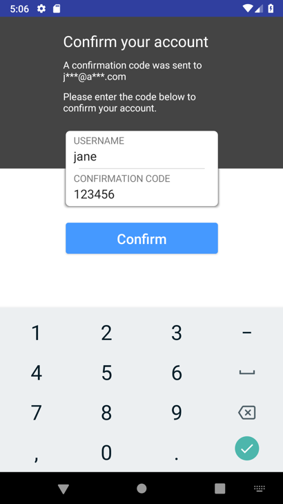

# Module Add Login

In this section we will install AWS Amplify CLI, add some backend functions and configure a sign-up and sign-in flow in our mobile backend.

## Getting Started

Before you begin, we need to install the following:

* Install the AWS CLI, follow the instructions [here](https://docs.aws.amazon.com/cli/latest/userguide/cli-chap-install.html)
* Complete the [Getting Started](https://aws-amplify.github.io/media/get_started) instructions to install the Amplify CLI.
Download and install [Android Studio](https://developer.android.com/studio/index.html) version 3.0.1 or later.
* Download and install [Android SDK](https://developer.android.com/studio/intro/update.html#sdk-manager) version 8.0 (Oreo), API level 26.
* Install an [Android Emulator](https://developer.android.com/studio/run/managing-avds.html). The app works with both phone and tablet emulators (for example, the Nexus 5X or Pixel C).

## Verify and open the project

* Download the source code as a [ZIP file](https://github.com/).  Unpack the downloaded ZIP file.
* Start Android Studio. If you have a project open already, choose **File** > **Close Project**.
* Choose **Start a new Android Studio project**. Fill the spaces:


* Select Phone and Tablet, choose **API 23: Android 6.0 (Marshmallow)**, and click Next.

* On the **Add an Activity to Mobile** screen, choose **Basic Activity**. Choose **Next**, keep the default values, and choose Finish to finish project setup.


## Run the Project in an Emulator

If you haven't, create a new emulator as follows:

1. Choose **Tools**  > **AVD Manager**.
2. Choose **Create Virtual Device...**.
3. Choose **Phone**  > **Nexus 5X**, and then choose **Next**.
4. Choose the **x86 Images** tab, and then choose **Android 9.0 (Google Play)**.
    * If you didn't previously downloaded the image, you can download it from this screen.
5. Choose **Next**.
6. Choose **Finish**.
7. Close the AVD Manager.

Run the project in an emulator as follows:

1. Choose **Run** > **Run 'app'**.
2. Choose the **Nexus 5X API 28** virtual device.
3. Choose **OK**.

If it isn't already running, the Android emulator starts and then the application runs. It will show only: Hello World:


## Import  the AWS AppSync SDK

To use AWS AppSync in our new Android project, modify the **project‘s build.gradle** file, and add the following dependency in the build script:

```gradle
classpath 'com.amazonaws:aws-android-sdk-appsync-gradle-plugin:2.9.+'
```

Next, in the **app‘s build.gradle**, add in a plugin of apply plugin: 'com.amazonaws.appsync' and dependencies for AWS AppSync.

As a result, your build.gradle should look like this:

```gradle
apply plugin: 'com.android.application'
apply plugin: 'com.amazonaws.appsync'
android {
    // ... typical items
}
dependencies {
    // ... typical dependencies

    implementation 'com.amazonaws:aws-android-sdk-appsync:2.9.+'
    implementation 'org.eclipse.paho:org.eclipse.paho.client.mqttv3:1.2.0'
    implementation 'org.eclipse.paho:org.eclipse.paho.android.service:1.1.1'
}
```

Finally, update your **AndroidManifest.xml** with updates to **< uses-permissions >** for network calls and offline states. Also, add a **< service >** entry under **< application >** for MqttService so we can use subscriptions:

```xml
<uses-permission android:name="android.permission.INTERNET"/>
<uses-permission android:name="android.permission.ACCESS_NETWORK_STATE"/>
<uses-permission android:name="android.permission.WAKE_LOCK" />
<uses-permission android:name="android.permission.READ_PHONE_STATE" />
<uses-permission android:name="android.permission.WRITE_EXTERNAL_STORAGE"/>
<uses-permission android:name="android.permission.READ_EXTERNAL_STORAGE"/>

        <!--other code-->

    <application
        android:allowBackup="true"
        android:icon="@mipmap/ic_launcher"
        android:label="@string/app_name"
        android:roundIcon="@mipmap/ic_launcher_round"
        android:supportsRtl="true"
        android:theme="@style/AppTheme">

        <service android:name="org.eclipse.paho.android.service.MqttService" />

        <!--other code-->
    </application>
```

The code should be like this:


**Build your project** and ensure that there are no issues.

## Configure AWS CLI

Choose **View**, choose **Tool Windows**, and then choose **Terminal**.  This opens a terminal prompt within Android Studio at the bottom of the window.
Configure the AWS CLI with the configure command, as follows:

```bash
aws configure
```

When prompted, specify the AWS access key and AWS secret access key of the IAM user to use. Also, be sure to specify the AWS Region where the repository exists, such as us-west-2. When prompted for the default output format, specify json.

## Create the backend on AWS

In the terminal window, enter the following commands, make sure you are on your Project root directory:

```bash
npm install -g @aws-amplify/cli -update

amplify init
```

The CLI prompts you the following information, the most important is the Res Directory and AWS profile.

```bash
? Enter a name for the project : PROJECT_NAME
? Enter a name for the environment:  mobilewks
? Choose your default editor: Visual Studio Code
? Choose the type of app that you are building: android
Please tell us about your project
? Where is your Res directory:  app/src/main/res
Using default provider  awscloudformation

? Do you want to use an AWS profile? Yes
? Please choose the profile you want to use :  default
```
AWS CloudFormation the initial infrastructure to support your app. After it’s done, the AWS Amplify CLI toolchain has initialized a new project, and you see a couple of new files and folders in your app’s project directory: amplify and .amplifyrc. These files hold your project’s configuration

If you subsequently update your API in the AppSync Console, you will need to re-run amplify codegen to update the local schema.json and .graphql with the modified schema:

```bash
amplify add codegen --apiId XXXXXX
```
The XXXXXX is the unique AppSync API identifier that you can find in the console in the root of your API’s integration page.

## Add authentication

In the next steps we will add authentication to the application and the backend to handle this. But first we will validate if auto import is enable:

> **Tip**
>
> You can set up Auto Import to automatically import classes that you need. On Windows or Linux, you can find Auto Import under **File** > **Settings**. On a Mac, you can find it under **Android Studio** > **Preferences**. The Auto Import setting is under **Editor** > **General** > **Auto Import** > **Java**. Change **Insert imports on paste** to **All** and select the **Add unambiguous imports on the fly** option.


Now we could open the terminal:

1. In the terminal window, enter the following commands:

```bash
amplify add api
```

It will prompt the following information:


* Please select from one of the below mentioned services **GraphQL**
* Provide API name: **AmplifyAndroid**
* Choose the default authorization type for the API **Amazon Cognito User Pool**
* Do you want to use the default authentication and security configuration? **Default configuration**
* How do you want users to be able to sign in? **Email**
* Do you want to configure advanced settings? **Yes, I want to make some additional changes.**
* What attributes are required for signing up? **Phone**
* Do you want to configure advanced settings for the GraphQL API **No, I am done.**
* Do you have an annotated GraphQL schema? **No**
* Do you want a guided schema creation? **Yes**
* What best describes your project: **Single object with fields (e.g., “Todo” with ID, name, description)**
* Do you want to edit the schema now? **Yes**
Please edit the file in your editor: /Users/joralfa/Documents/ImmersionDay/MobileApp/AppJAH/amplify/backend/api/AmplifyAndroid/schema.graphql

It will open the graphql Schema on your defualt editor, replace all with the following code:

```json
type Pet @model {
  id: ID!
  name: String!
  description: String
}
```

Go back to the terminal, and press Enter to continue.

Next, let’s push the configuration to your AWS account by running:

```bash
amplify push
```

You’re prompted with your added changes:

```bash
| Category | Resource name          | Operation | Provider plugin   |
| -------- | ---------------------- | --------- | ----------------- |
| Auth     | cognito12345678        | Create    | awscloudformation |
| Api      | AmplifyAndroidWorkshop | Create    | awscloudformation |

Are you sure you want to continue? (Y/n) Y
```

Now you’re prompted to generate code for your brand new API:


* Do you want to generate code for your newly created GraphQL API (Y/n) **Y**
* Enter the file name pattern of queries, mutations and subscriptions (app/src/main/graphql/**/*.graphql): **Press Enter to accept the default.**
* Do you want to generate/update all possible GraphQL operations – queries, mutations and subscriptions (Y/n) **Y**

This will create several things on AWS, like AIM roles, Congnito UserPool, Lambda Policy. AWS CloudFormation runs again to update the newly created API and authentication mechanism to your AWS account. This process might take a few minutes.

After AWS CloudFormation completes updating resources in the cloud, you’re given a GraphQL API endpoint, and generated GraphQL statements are available in your project.


### Add AWS SDK for Android Library

When we configure Amplify we selected Congnito user pool for authentication, we need to integrate authentication to our app. For simplicity, we’re going to leverage the AWS Mobile library’s built-in sign-in UI for Amazon Cognito authentication.

1. Edit the `app/build.gradle` file. Add the following lines to the `dependencies` section:

```gradle
//For AWSMobileClient only:
implementation 'com.amazonaws:aws-android-sdk-mobile-client:2.15.+'

//For the drop-in UI also:
implementation 'com.amazonaws:aws-android-sdk-auth-userpools:2.15.+'
implementation 'com.amazonaws:aws-android-sdk-auth-ui:2.15.+'
```

2. Choose **Sync Now** on the upper-right corner to incorporate the dependencies you just declared.

### Create an AuthenticationActivity.java class

Right-click your app directory, and choose **New** -> **Activity** -> **Empty Activity**. Name your activity ***AuthenticationActivity***, select the **Launcher Activity** check box, and click **Finish**.

In the **AuthenticationActivity.java** class, modify the class to be the following:

```java
public class AuthenticationActivity extends AppCompatActivity {

    private final String TAG = AuthenticationActivity.class.getSimpleName();
    @Override
    protected void onCreate(Bundle savedInstanceState) {
        super.onCreate(savedInstanceState);
        setContentView(R.layout.activity_authentication);

        AWSMobileClient.getInstance().initialize(getApplicationContext(), new Callback<UserStateDetails>() {

            @Override
            public void onResult(UserStateDetails userStateDetails) {
                Log.i(TAG, userStateDetails.getUserState().toString());
                switch (userStateDetails.getUserState()){
                    case SIGNED_IN:
                        Intent i = new Intent(AuthenticationActivity.this, MainActivity.class);
                        startActivity(i);
                        break;
                    case SIGNED_OUT:
                        showSignIn();
                        break;
                    default:
                        AWSMobileClient.getInstance().signOut();
                        showSignIn();
                        break;
                }
            }

            @Override
            public void onError(Exception e) {
                Log.e(TAG, e.toString());
            }
        });
    }

    private void showSignIn() {
        try {
            AWSMobileClient.getInstance().showSignIn(this,
                 SignInUIOptions.builder().nextActivity(MainActivity.class).build());
        } catch (Exception e) {
            Log.e(TAG, e.toString());
        }
    }
}
```

If the code have an error, delete **new Callback < UserStateDetails > ()** and type manually. Becareful that will add new code for **onResult**, you should delete it.

Now let’s make sure that the AuthenticationActivity is our launcher activity. Open ***AndroidManifest.xml***, and ensure that the ```<intent-filter>``` block is specified for the **AuthenticationActivity** as follows. You must remove the ```<intent-filter>``` and ***android:theme*** for ***MainActivity***.

```html
<!-- ... Other Code... -->
<activity
    android:name=".MainActivity"
    android:label="@string/app_name">
</activity>
<activity
    android:name=".AuthenticationActivity"
    android:noHistory="true">
    <intent-filter>
        <action android:name="android.intent.action.MAIN" />
        <category android:name="android.intent.category.LAUNCHER" />
    </intent-filter>
</activity>
```

Now let's modify ***activity_main.xml*** and shoult look like this:

```xml
<?xml version="1.0" encoding="utf-8"?>
<android.support.design.widget.CoordinatorLayout xmlns:android="http://schemas.android.com/apk/res/android"
    xmlns:app="http://schemas.android.com/apk/res-auto"
    xmlns:tools="http://schemas.android.com/tools"
    android:layout_width="match_parent"
    android:layout_height="match_parent"
    tools:context=".MainActivity">

    <include layout="@layout/content_main" />

    <android.support.design.widget.FloatingActionButton
        android:id="@+id/fab"
        android:layout_width="wrap_content"
        android:layout_height="wrap_content"
        android:layout_gravity="bottom|end"
        android:layout_margin="@dimen/fab_margin"
        app:srcCompat="@android:drawable/ic_dialog_email" />

</android.support.design.widget.CoordinatorLayout>
```

MainActivity.java, erase the code of the Toolbar, and only left the code like this:

```java
public class MainActivity extends AppCompatActivity {
    @Override
     protected void onCreate(Bundle savedInstanceState) {
        super.onCreate(savedInstanceState);
        setContentView(R.layout.activity_main);
     }
}
```

> **Tip**
>
> If you see an error such as Unable to resolve host "cognito-idp.us-east-1.amazonaws.com", double check that your emulator has internet connectivity. Restart the emulator if needed.

Build and start your app in your emulator. The sign-in UI should show up as follows:
 
 

Create a new user, add all data need and a valid e-mail to received the code to complete the Sign up process.

 

When the login is successful it will request to install the ARCore package on PlayStore. Install it and wait to finish.


## Troubleshooting

The most common problems at this stage involve issues with the installation of Java, Android Studio, the Android SDK, or the Android Emulator. Google provides detailed instructions about [Android Studio](https://developer.android.com/studio/index.html>) and dependent features.

## Next Step

Next, [Create Backend](./data.md) into your project.